# 图像视觉断言 Agent 技术文档

> 基于豆包视觉大模型的智能图像内容验证服务

---

## 目录

1. [项目概述](#1-项目概述)
2. [系统架构](#2-系统架构)
3. [核心流程](#3-核心流程)
4. [数据模型](#4-数据模型)
5. [API接口文档](#5-api接口文档)
6. [模块设计](#6-模块设计)
7. [部署指南](#7-部署指南)
8. [使用示例](#8-使用示例)

---

## 1. 项目概述

### 1.1 项目简介

图像视觉断言 Agent 是一个基于豆包（Doubao）视觉大模型的智能图像内容验证服务。用户可以上传图片并描述预期内容，系统会自动分析图片并返回结构化的断言结果，包括物品匹配、数量匹配等详细信息。

### 1.2 核心功能

- **图像内容识别**: 基于豆包视觉大模型分析图片内容
- **预期断言验证**: 验证图片内容是否符合用户预期
- **双图对比功能**: 支持上传测试图+预期图进行对比分析
- **智能对比模式**: 根据图片分辨率自动选择对比模式
  - **整体相似度对比**: 分辨率相同时，对比两张图片的整体相似度
  - **局部图匹配**: 分辨率不同时，在测试图中查找预期图（局部图）
- **结构化输出**: 返回标准JSON Schema格式的断言结果
- **异步处理**: 支持异步任务处理，不阻塞前端
- **可视化界面**: 提供美观的Web界面进行交互
- **API重试机制**: 指数退避重试，提高服务稳定性
- **持久化存储**: SQLite数据库持久化任务和结果
- **完整日志追踪**: 支持请求追踪ID，JSON格式日志
- **置信度阈值**: 可配置的置信度阈值，支持低置信度重试

### 1.3 技术栈

| 层级 | 技术选型 |
|------|----------|
| 后端框架 | FastAPI |
| AI模型 | 豆包视觉大模型 (Doubao Vision) |
| API协议 | OpenAI Compatible API |
| 数据验证 | Pydantic v2 |
| 图像处理 | Pillow (PIL) |
| 持久化存储 | SQLite3 |
| 日志系统 | Python logging + JSON格式 |
| 前端 | HTML5 + CSS3 + Vanilla JavaScript |
| 异步处理 | Python Threading |

---

## 2. 系统架构

### 2.1 整体架构图

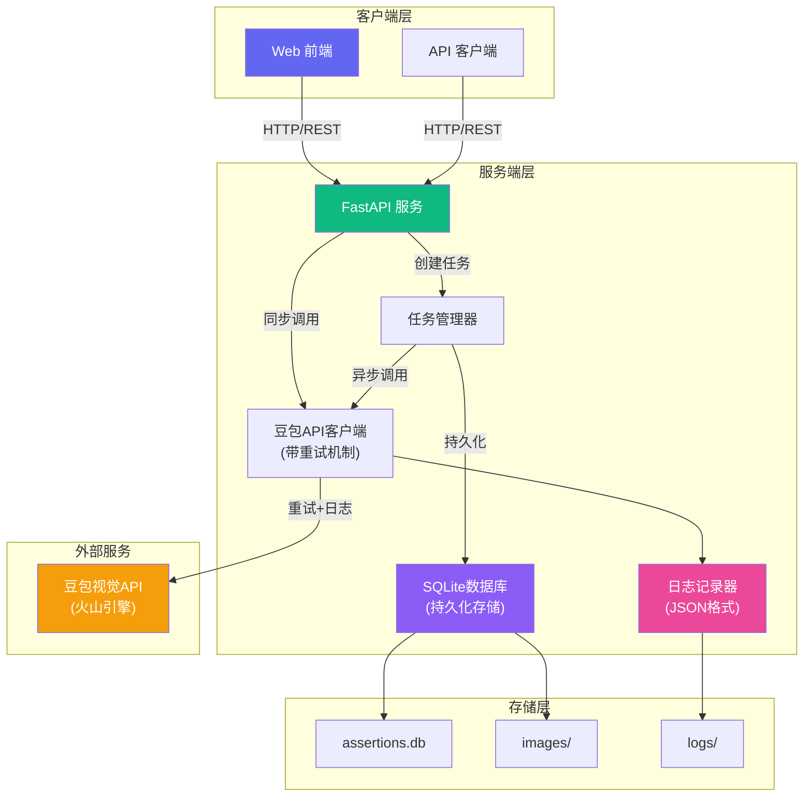
```mermaid
graph TB
    subgraph Client["客户端层"]
        Web["Web 前端"]
        API_Client["API 客户端"]
    end

    subgraph Server["服务端层"]
        FastAPI["FastAPI 服务"]
        TaskManager["任务管理器"]
        DoubaoClient["豆包API客户端<br/>(带重试机制)"]
        Logger["日志记录器<br/>(JSON格式)"]
        Database["SQLite数据库<br/>(持久化存储)"]
    end

    subgraph Storage["存储层"]
        SQLite["assertions.db"]
        ImageStore["images/"]
        LogFiles["logs/"]
    end

    subgraph External["外部服务"]
        DoubaoAPI["豆包视觉API<br/>(火山引擎)"]
    end

    Web -->|"HTTP/REST"| FastAPI
    API_Client -->|"HTTP/REST"| FastAPI
    FastAPI -->|"创建任务"| TaskManager
    FastAPI -->|"同步调用"| DoubaoClient
    TaskManager -->|"异步调用"| DoubaoClient
    TaskManager -->|"持久化"| Database
    DoubaoClient -->|"重试+日志"| DoubaoAPI
    DoubaoClient --> Logger
    Database --> SQLite
    Database --> ImageStore
    Logger --> LogFiles

    style Web fill:#6366f1,color:#fff
    style FastAPI fill:#10b981,color:#fff
    style DoubaoAPI fill:#f59e0b,color:#fff
    style Database fill:#8b5cf6,color:#fff
    style Logger fill:#ec4899,color:#fff
```

### 2.2 组件架构图

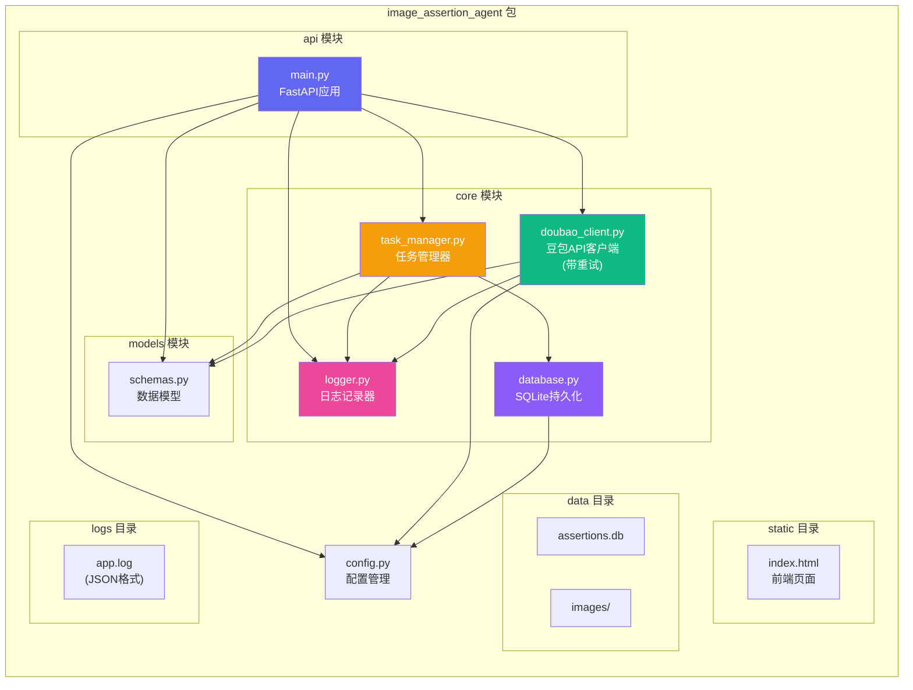
```mermaid
graph LR
    subgraph image_assertion_agent["image_assertion_agent 包"]
        subgraph api["api 模块"]
            main["main.py<br/>FastAPI应用"]
        end

        subgraph core["core 模块"]
            doubao["doubao_client.py<br/>豆包API客户端<br/>(带重试)"]
            task["task_manager.py<br/>任务管理器"]
            database["database.py<br/>SQLite持久化"]
            logger["logger.py<br/>日志记录器"]
        end

        subgraph models["models 模块"]
            schemas["schemas.py<br/>数据模型"]
        end

        subgraph static["static 目录"]
            html["index.html<br/>前端页面"]
        end

        subgraph data["data 目录"]
            db["assertions.db"]
            images["images/"]
        end

        subgraph logs["logs 目录"]
            logfile["app.log<br/>(JSON格式)"]
        end

        config["config.py<br/>配置管理"]
    end

    main --> doubao
    main --> task
    main --> schemas
    main --> config
    main --> logger
    task --> schemas
    task --> database
    task --> logger
    doubao --> schemas
    doubao --> config
    doubao --> logger
    database --> config

    style main fill:#6366f1,color:#fff
    style doubao fill:#10b981,color:#fff
    style task fill:#f59e0b,color:#fff
    style database fill:#8b5cf6,color:#fff
    style logger fill:#ec4899,color:#fff
```

### 2.3 目录结构

```
image_assertion_agent/
├── __init__.py              # 包初始化
├── config.py                # 配置管理（含重试、日志、数据库配置）
├── run.py                   # 启动脚本
├── requirements.txt         # 依赖清单
├── .env.example             # 环境变量示例
├── client_example.py        # Python客户端示例
│
├── api/
│   ├── __init__.py
│   └── main.py              # FastAPI 主应用
│
├── core/
│   ├── __init__.py
│   ├── doubao_client.py     # 豆包API客户端（带重试机制）
│   ├── task_manager.py      # 异步任务管理器（集成持久化）
│   ├── database.py          # SQLite持久化存储模块
│   └── logger.py            # 日志记录模块（JSON格式）
│
├── models/
│   ├── __init__.py
│   └── schemas.py           # Pydantic 数据模型
│
├── static/
│   └── index.html           # 前端页面
│
├── data/                    # 数据存储目录（自动创建）
│   ├── assertions.db        # SQLite数据库
│   └── images/              # 图片存储（按日期分目录）
│       └── 2024-01-15/
│           └── abc123.jpg
│
├── logs/                    # 日志目录（自动创建）
│   └── app.log              # JSON格式日志文件
│
├── docs/
│   └── TECHNICAL_DOC.md     # 技术文档
│
└── tests/
    ├── __init__.py
    └── test_api.py          # API测试用例
```

---

## 3. 核心流程

### 3.1 同步断言流程

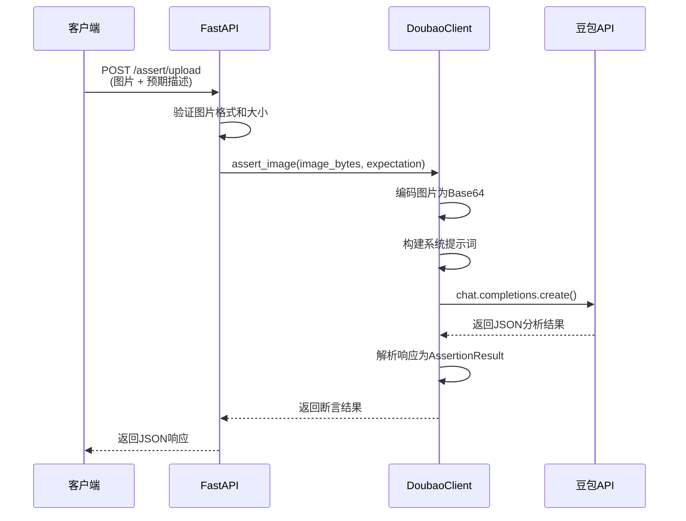
```mermaid
sequenceDiagram
    participant C as 客户端
    participant F as FastAPI
    participant D as DoubaoClient
    participant A as 豆包API

    C->>F: POST /assert/upload<br/>(图片 + 预期描述)
    F->>F: 验证图片格式和大小
    F->>D: assert_image(image_bytes, expectation)
    D->>D: 编码图片为Base64
    D->>D: 构建系统提示词
    D->>A: chat.completions.create()
    A-->>D: 返回JSON分析结果
    D->>D: 解析响应为AssertionResult
    D-->>F: 返回断言结果
    F-->>C: 返回JSON响应
```

### 3.2 异步断言流程

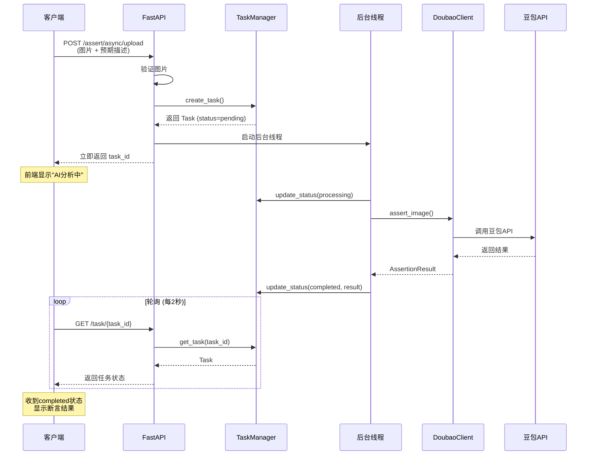
```mermaid
sequenceDiagram
    participant C as 客户端
    participant F as FastAPI
    participant TM as TaskManager
    participant T as 后台线程
    participant D as DoubaoClient
    participant A as 豆包API

    C->>F: POST /assert/async/upload<br/>(图片 + 预期描述)
    F->>F: 验证图片
    F->>TM: create_task()
    TM-->>F: 返回 Task (status=pending)
    F->>T: 启动后台线程
    F-->>C: 立即返回 task_id

    Note over C: 前端显示"AI分析中"

    T->>TM: update_status(processing)
    T->>D: assert_image()
    D->>A: 调用豆包API
    A-->>D: 返回结果
    D-->>T: AssertionResult
    T->>TM: update_status(completed, result)

    loop 轮询 (每2秒)
        C->>F: GET /task/{task_id}
        F->>TM: get_task(task_id)
        TM-->>F: Task
        F-->>C: 返回任务状态
    end

    Note over C: 收到completed状态<br/>显示断言结果
```

### 3.3 前端交互流程

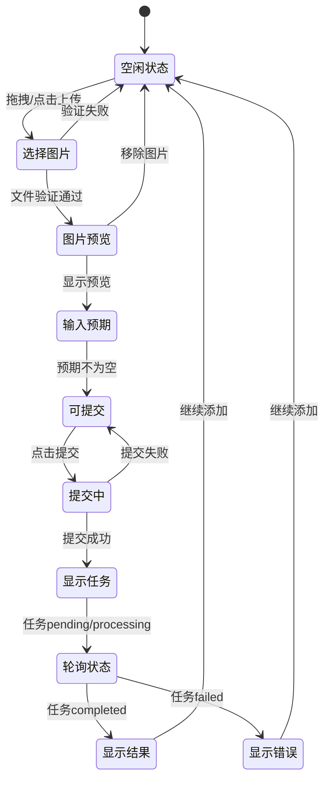
```mermaid
stateDiagram-v2
    [*] --> 空闲状态
    空闲状态 --> 选择图片: 拖拽/点击上传
    选择图片 --> 图片预览: 文件验证通过
    选择图片 --> 空闲状态: 验证失败

    图片预览 --> 空闲状态: 移除图片
    图片预览 --> 输入预期: 显示预览

    输入预期 --> 可提交: 预期不为空
    可提交 --> 提交中: 点击提交

    提交中 --> 显示任务: 提交成功
    提交中 --> 可提交: 提交失败

    显示任务 --> 轮询状态: 任务pending/processing
    轮询状态 --> 显示结果: 任务completed
    轮询状态 --> 显示错误: 任务failed

    显示结果 --> 空闲状态: 继续添加
    显示错误 --> 空闲状态: 继续添加
```

### 3.4 任务状态机

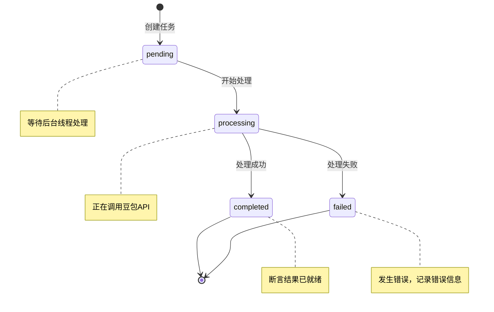
```mermaid
stateDiagram-v2
    [*] --> pending: 创建任务

    pending --> processing: 开始处理
    processing --> completed: 处理成功
    processing --> failed: 处理失败

    completed --> [*]
    failed --> [*]

    note right of pending
        等待后台线程处理
    end note

    note right of processing
        正在调用豆包API
    end note

    note right of completed
        断言结果已就绪
    end note

    note right of failed
        发生错误，记录错误信息
    end note
```

### 3.5 图片对比模式选择流程

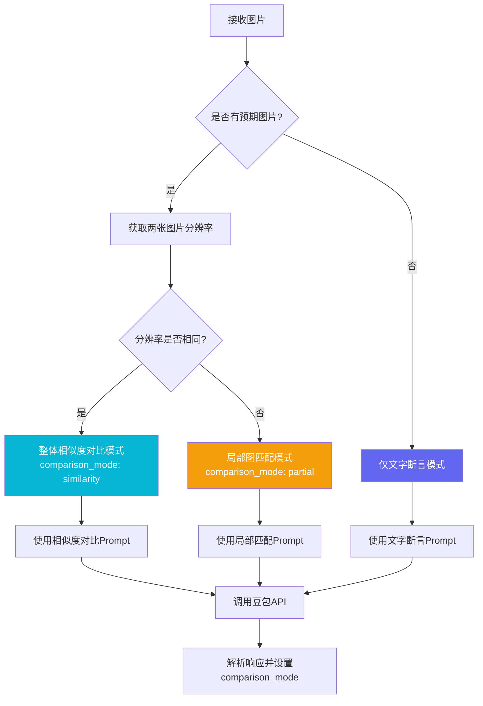
```mermaid
flowchart TB
    A[接收图片] --> B{是否有预期图片?}
    B -->|否| C[仅文字断言模式]
    B -->|是| D[获取两张图片分辨率]

    D --> E{分辨率是否相同?}

    E -->|是| F[整体相似度对比模式<br/>comparison_mode: similarity]
    E -->|否| G[局部图匹配模式<br/>comparison_mode: partial]

    F --> H[使用相似度对比Prompt]
    G --> I[使用局部匹配Prompt]
    C --> J[使用文字断言Prompt]

    H --> K[调用豆包API]
    I --> K
    J --> K

    K --> L[解析响应并设置comparison_mode]

    style F fill:#06b6d4,color:#fff
    style G fill:#f59e0b,color:#fff
    style C fill:#6366f1,color:#fff
```

### 3.6 对比模式详解

| 模式 | 触发条件 | 用途 | comparison_mode |
|------|----------|------|-----------------|
| 文字断言 | 仅提供文字预期 | 验证图片内容是否符合文字描述 | `null` |
| 整体相似度 | 提供预期图，且分辨率相同 | 判断两张图是否相同/相似 | `"similarity"` |
| 局部图匹配 | 提供预期图，且分辨率不同 | 在测试图中查找局部图内容 | `"partial"` |

**整体相似度对比模式**特点：
- 用于判断两张图片是否是相同或相似的图片
- 关注内容、颜色、布局、细节的整体相似程度
- 相似度评分：完全相同=1.0，完全不同<0.3

**局部图匹配模式**特点：
- 用于在大图中查找小图（局部图）的内容
- 返回匹配位置描述（如"左上角"、"中央"等）
- 适合产品检测、元素定位等场景

### 3.7 API重试机制

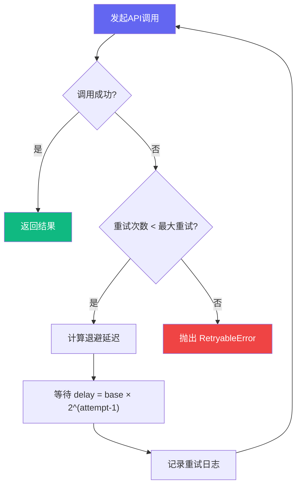
```mermaid
flowchart TB
    A[发起API调用] --> B{调用成功?}
    B -->|是| C[返回结果]
    B -->|否| D{重试次数 < 最大重试?}
    D -->|是| E[计算退避延迟]
    E --> F["等待 delay = base × 2^(attempt-1)"]
    F --> G[记录重试日志]
    G --> A
    D -->|否| H[抛出 RetryableError]

    style A fill:#6366f1,color:#fff
    style C fill:#10b981,color:#fff
    style H fill:#ef4444,color:#fff
```

**重试配置参数**

| 参数 | 默认值 | 说明 |
|------|--------|------|
| `API_MAX_RETRIES` | 3 | 最大重试次数 |
| `API_RETRY_BASE_DELAY` | 2.0秒 | 基础延迟时间 |
| `API_RETRY_MAX_DELAY` | 30.0秒 | 最大延迟时间 |
| `API_TIMEOUT` | 60.0秒 | API调用超时时间 |

**退避延迟计算**
```python
delay = min(base_delay × 2^(attempt-1), max_delay)
# 示例：2s → 4s → 8s → 16s → ... → 30s (上限)
```

### 3.8 持久化存储架构

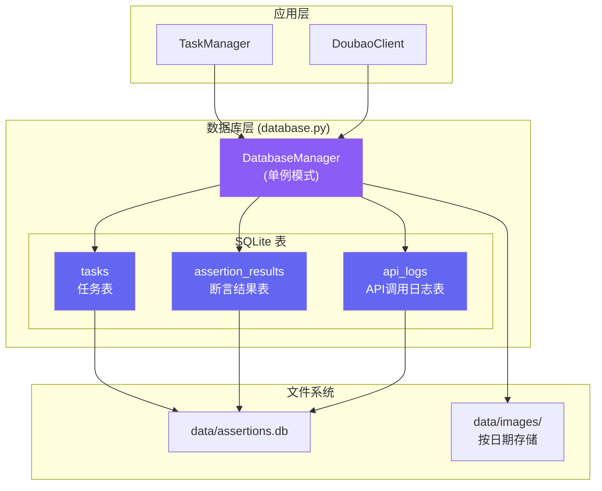
```mermaid
graph TB
    subgraph Application["应用层"]
        TM["TaskManager"]
        DC["DoubaoClient"]
    end

    subgraph Database["数据库层 (database.py)"]
        DBM["DatabaseManager<br/>(单例模式)"]

        subgraph Tables["SQLite 表"]
            T1["tasks<br/>任务表"]
            T2["assertion_results<br/>断言结果表"]
            T3["api_logs<br/>API调用日志表"]
        end
    end

    subgraph FileSystem["文件系统"]
        DB["data/assertions.db"]
        IMG["data/images/<br/>按日期存储"]
    end

    TM --> DBM
    DC --> DBM
    DBM --> T1
    DBM --> T2
    DBM --> T3
    T1 --> DB
    T2 --> DB
    T3 --> DB
    DBM --> IMG

    style DBM fill:#8b5cf6,color:#fff
    style T1 fill:#6366f1,color:#fff
    style T2 fill:#6366f1,color:#fff
    style T3 fill:#6366f1,color:#fff
```

**数据库表结构**

```sql
-- 任务表
CREATE TABLE tasks (
    task_id TEXT PRIMARY KEY,
    expectation TEXT,
    image_path TEXT,           -- 图片文件路径
    image_type TEXT,           -- base64/url
    expect_image_path TEXT,    -- 预期图片路径
    expect_image_type TEXT,
    status TEXT DEFAULT 'pending',
    error TEXT,
    created_at TIMESTAMP,
    completed_at TIMESTAMP,
    duration_ms REAL
);

-- 断言结果表
CREATE TABLE assertion_results (
    id INTEGER PRIMARY KEY AUTOINCREMENT,
    task_id TEXT REFERENCES tasks(task_id),
    assertion_passed BOOLEAN,
    confidence REAL,
    comparison_mode TEXT,
    raw_response TEXT,         -- 原始API响应
    result_json TEXT,          -- 完整结果JSON
    created_at TIMESTAMP
);

-- API调用日志表
CREATE TABLE api_logs (
    id INTEGER PRIMARY KEY AUTOINCREMENT,
    task_id TEXT,
    request_type TEXT,         -- assert_image/assert_image_url
    attempt_number INTEGER,
    success BOOLEAN,
    error_message TEXT,
    response_time_ms REAL,
    created_at TIMESTAMP
);
```

### 3.9 日志追踪系统

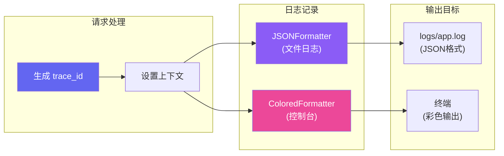
```mermaid
flowchart LR
    subgraph Request["请求处理"]
        R1["生成 trace_id"]
        R2["设置上下文"]
    end

    subgraph Logging["日志记录"]
        L1["JSONFormatter<br/>(文件日志)"]
        L2["ColoredFormatter<br/>(控制台)"]
    end

    subgraph Output["输出目标"]
        O1["logs/app.log<br/>(JSON格式)"]
        O2["终端<br/>(彩色输出)"]
    end

    R1 --> R2
    R2 --> L1
    R2 --> L2
    L1 --> O1
    L2 --> O2

    style R1 fill:#6366f1,color:#fff
    style L1 fill:#8b5cf6,color:#fff
    style L2 fill:#ec4899,color:#fff
```

**日志格式示例**

JSON文件日志 (`logs/app.log`):
```json
{
  "timestamp": "2024-01-15T10:30:15.123456",
  "level": "INFO",
  "trace_id": "abc12345",
  "task_id": "550e8400-e29b-41d4-a716-446655440000",
  "message": "任务创建成功",
  "extra": {
    "expectation": "这张图里面有一双运动鞋",
    "image_type": "base64"
  }
}
```

控制台彩色输出:
```
2024-01-15 10:30:15 [INFO] [abc12345] 任务创建成功 | task_id=550e8400...
```

**日志级别说明**

| 级别 | 用途 | 颜色 |
|------|------|------|
| DEBUG | 调试信息 | 灰色 |
| INFO | 正常操作 | 绿色 |
| WARNING | 警告信息（如低置信度） | 黄色 |
| ERROR | 错误信息 | 红色 |
| CRITICAL | 严重错误 | 红色加粗 |

### 3.10 置信度阈值机制

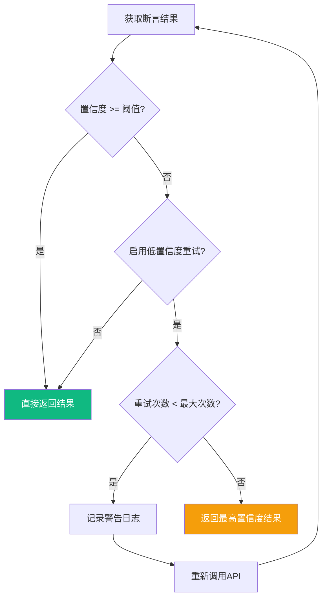
```mermaid
flowchart TB
    A[获取断言结果] --> B{置信度 >= 阈值?}
    B -->|是| C[直接返回结果]
    B -->|否| D{启用低置信度重试?}
    D -->|是| E{重试次数 < 最大次数?}
    E -->|是| F[记录警告日志]
    F --> G[重新调用API]
    G --> A
    E -->|否| H[返回最高置信度结果]
    D -->|否| C

    style C fill:#10b981,color:#fff
    style H fill:#f59e0b,color:#fff
```

**配置参数**

| 参数 | 默认值 | 说明 |
|------|--------|------|
| `CONFIDENCE_THRESHOLD` | 0.7 | 置信度阈值 (0.0-1.0) |
| `LOW_CONFIDENCE_RETRY` | true | 是否启用低置信度重试 |

---

## 4. 数据模型

### 4.1 类图

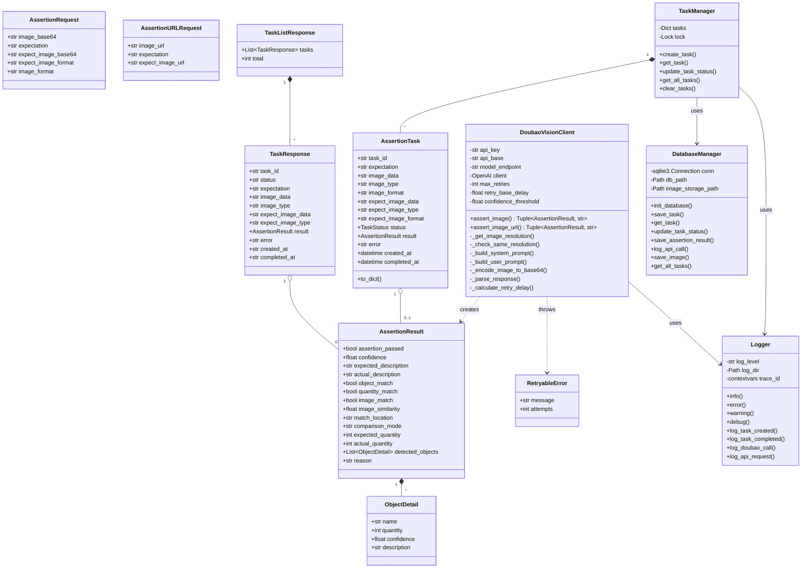
```mermaid
classDiagram
    class ObjectDetail {
        +str name
        +int quantity
        +float confidence
        +str description
    }

    class AssertionResult {
        +bool assertion_passed
        +float confidence
        +str expected_description
        +str actual_description
        +bool object_match
        +bool quantity_match
        +bool image_match
        +float image_similarity
        +str match_location
        +str comparison_mode
        +int expected_quantity
        +int actual_quantity
        +List~ObjectDetail~ detected_objects
        +str reason
    }

    class AssertionRequest {
        +str image_base64
        +str expectation
        +str expect_image_base64
        +str expect_image_format
        +str image_format
    }

    class AssertionURLRequest {
        +str image_url
        +str expectation
        +str expect_image_url
    }

    class TaskResponse {
        +str task_id
        +str status
        +str expectation
        +str image_data
        +str image_type
        +str expect_image_data
        +str expect_image_type
        +AssertionResult result
        +str error
        +str created_at
        +str completed_at
    }

    class TaskListResponse {
        +List~TaskResponse~ tasks
        +int total
    }

    class AssertionTask {
        +str task_id
        +str expectation
        +str image_data
        +str image_type
        +str image_format
        +str expect_image_data
        +str expect_image_type
        +str expect_image_format
        +TaskStatus status
        +AssertionResult result
        +str error
        +datetime created_at
        +datetime completed_at
        +to_dict()
    }

    class TaskManager {
        -Dict tasks
        -Lock lock
        +create_task()
        +get_task()
        +update_task_status()
        +get_all_tasks()
        +clear_tasks()
    }

    class DoubaoVisionClient {
        -str api_key
        -str api_base
        -str model_endpoint
        -OpenAI client
        -int max_retries
        -float retry_base_delay
        -float confidence_threshold
        +assert_image() Tuple~AssertionResult, str~
        +assert_image_url() Tuple~AssertionResult, str~
        -_get_image_resolution()
        -_check_same_resolution()
        -_build_system_prompt()
        -_build_user_prompt()
        -_encode_image_to_base64()
        -_parse_response()
        -_calculate_retry_delay()
    }

    class DatabaseManager {
        -sqlite3.Connection conn
        -Path db_path
        -Path image_storage_path
        +init_database()
        +save_task()
        +get_task()
        +update_task_status()
        +save_assertion_result()
        +log_api_call()
        +save_image()
        +get_all_tasks()
    }

    class Logger {
        -str log_level
        -Path log_dir
        -contextvars trace_id
        +info()
        +error()
        +warning()
        +debug()
        +log_task_created()
        +log_task_completed()
        +log_doubao_call()
        +log_api_request()
    }

    class RetryableError {
        +str message
        +int attempts
    }

    AssertionResult "1" *-- "*" ObjectDetail
    TaskResponse "1" o-- "0..1" AssertionResult
    TaskListResponse "1" *-- "*" TaskResponse
    AssertionTask "1" o-- "0..1" AssertionResult
    TaskManager "1" *-- "*" AssertionTask
    TaskManager --> DatabaseManager : uses
    TaskManager --> Logger : uses
    DoubaoVisionClient ..> AssertionResult : creates
    DoubaoVisionClient ..> RetryableError : throws
    DoubaoVisionClient --> Logger : uses
```

### 4.2 断言结果 Schema

**文字预期断言结果**

```json
{
  "assertion_passed": true,
  "confidence": 0.92,
  "expected_description": "这张图里面有一双运动鞋",
  "actual_description": "图片中可以看到一双白色的Nike运动鞋，放置在木地板上",
  "object_match": true,
  "quantity_match": true,
  "image_match": null,
  "image_similarity": null,
  "match_location": null,
  "comparison_mode": null,
  "expected_quantity": 2,
  "actual_quantity": 2,
  "detected_objects": [
    {
      "name": "运动鞋",
      "quantity": 2,
      "confidence": 0.95,
      "description": "白色Nike运动鞋"
    }
  ],
  "reason": "图片中确实存在一双（两只）运动鞋，物品类型和数量均符合预期"
}
```

**双图对比结果 - 整体相似度模式（分辨率相同）**

```json
{
  "assertion_passed": true,
  "confidence": 0.95,
  "expected_description": "",
  "actual_description": "两张图片内容基本一致，均为同一双白色运动鞋",
  "object_match": true,
  "quantity_match": true,
  "image_match": true,
  "image_similarity": 0.92,
  "match_location": "整体对比",
  "comparison_mode": "similarity",
  "expected_quantity": 2,
  "actual_quantity": 2,
  "detected_objects": [...],
  "reason": "两张图片分辨率相同，整体对比相似度为92%，主体内容一致"
}
```

**双图对比结果 - 局部图匹配模式（分辨率不同）**

```json
{
  "assertion_passed": true,
  "confidence": 0.88,
  "expected_description": "",
  "actual_description": "在测试图的中央位置找到了与预期图相似的运动鞋",
  "object_match": true,
  "quantity_match": true,
  "image_match": true,
  "image_similarity": 0.85,
  "match_location": "中央偏右",
  "comparison_mode": "partial",
  "expected_quantity": null,
  "actual_quantity": 1,
  "detected_objects": [...],
  "reason": "在测试图中找到了与预期图（局部图）匹配的运动鞋，位于图片中央偏右位置"
}
```

### 4.3 任务状态枚举

| 状态 | 值 | 描述 |
|------|-----|------|
| PENDING | `pending` | 任务已创建，等待处理 |
| PROCESSING | `processing` | 正在调用AI分析 |
| COMPLETED | `completed` | 分析完成，结果就绪 |
| FAILED | `failed` | 处理失败，记录错误信息 |

### 4.4 对比模式枚举

| 模式 | 值 | 描述 |
|------|-----|------|
| 无 | `null` | 仅文字预期，无图片对比 |
| 整体相似度 | `"similarity"` | 分辨率相同，整体相似度对比 |
| 局部匹配 | `"partial"` | 分辨率不同，局部图匹配 |

### 4.5 新增字段说明

| 字段 | 类型 | 描述 |
|------|------|------|
| `image_match` | bool \| null | 图片是否匹配（仅双图对比时有值） |
| `image_similarity` | float \| null | 图片相似度 0.0-1.0（仅双图对比时有值） |
| `match_location` | string \| null | 匹配位置描述（局部匹配时为位置，整体对比时为"整体对比"） |
| `comparison_mode` | string \| null | 对比模式："similarity"、"partial" 或 null |
| `expect_image_data` | string \| null | 预期图片数据（base64或URL） |
| `expect_image_type` | string \| null | 预期图片类型："base64"或"url" |

---

## 5. API接口文档

### 5.1 接口总览

| 接口 | 方法 | 描述 | 阻塞 |
|------|------|------|------|
| `/` | GET | 前端页面 | - |
| `/health` | GET | 健康检查 | - |
| `/assert/upload` | POST | 同步文件上传断言 | 是 |
| `/assert/base64` | POST | 同步Base64断言 | 是 |
| `/assert/url` | POST | 同步URL断言 | 是 |
| `/assert/async/upload` | POST | 异步文件上传断言 | 否 |
| `/assert/async/base64` | POST | 异步Base64断言 | 否 |
| `/assert/async/url` | POST | 异步URL断言 | 否 |
| `/task/{task_id}` | GET | 获取任务状态 | - |
| `/tasks` | GET | 获取任务列表 | - |
| `/tasks` | DELETE | 清空所有任务 | - |

### 5.2 异步上传断言

**请求**

```http
POST /assert/async/upload
Content-Type: multipart/form-data
```

| 参数 | 类型 | 必填 | 描述 |
|------|------|------|------|
| image | File | 是 | 测试图片文件 |
| expectation | string | 否* | 文字预期描述 |
| expect_image | File | 否* | 预期图片（局部图/参考图） |

> *注：`expectation` 和 `expect_image` 至少需要提供一个

**响应**

```json
{
  "task_id": "550e8400-e29b-41d4-a716-446655440000",
  "status": "pending",
  "expectation": "这张图里面有一双运动鞋",
  "image_data": "base64...",
  "image_type": "base64",
  "expect_image_data": "base64...",
  "expect_image_type": "base64",
  "created_at": "2024-01-15T10:30:00"
}
```

### 5.3 获取任务状态

**请求**

```http
GET /task/{task_id}
```

**响应 (处理中)**

```json
{
  "task_id": "550e8400-e29b-41d4-a716-446655440000",
  "status": "processing",
  "expectation": "这张图里面有一双运动鞋",
  "image_data": "base64...",
  "image_type": "base64",
  "result": null,
  "error": null,
  "created_at": "2024-01-15T10:30:00",
  "completed_at": null
}
```

**响应 (已完成)**

```json
{
  "task_id": "550e8400-e29b-41d4-a716-446655440000",
  "status": "completed",
  "expectation": "这张图里面有一双运动鞋",
  "image_data": "base64...",
  "image_type": "base64",
  "result": {
    "assertion_passed": true,
    "confidence": 0.92,
    "object_match": true,
    "quantity_match": true,
    ...
  },
  "error": null,
  "created_at": "2024-01-15T10:30:00",
  "completed_at": "2024-01-15T10:30:15"
}
```

### 5.4 API调用时序

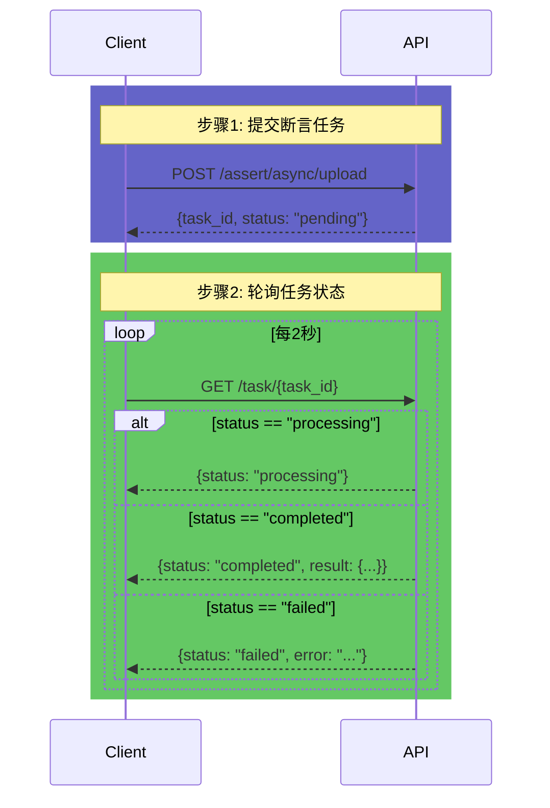
```mermaid
sequenceDiagram
    participant Client
    participant API

    rect rgb(100, 100, 200)
        Note over Client, API: 步骤1: 提交断言任务
        Client->>API: POST /assert/async/upload
        API-->>Client: {task_id, status: "pending"}
    end

    rect rgb(100, 200, 100)
        Note over Client, API: 步骤2: 轮询任务状态
        loop 每2秒
            Client->>API: GET /task/{task_id}
            alt status == "processing"
                API-->>Client: {status: "processing"}
            else status == "completed"
                API-->>Client: {status: "completed", result: {...}}
            else status == "failed"
                API-->>Client: {status: "failed", error: "..."}
            end
        end
    end
```

---

## 6. 模块设计

### 6.1 豆包客户端模块

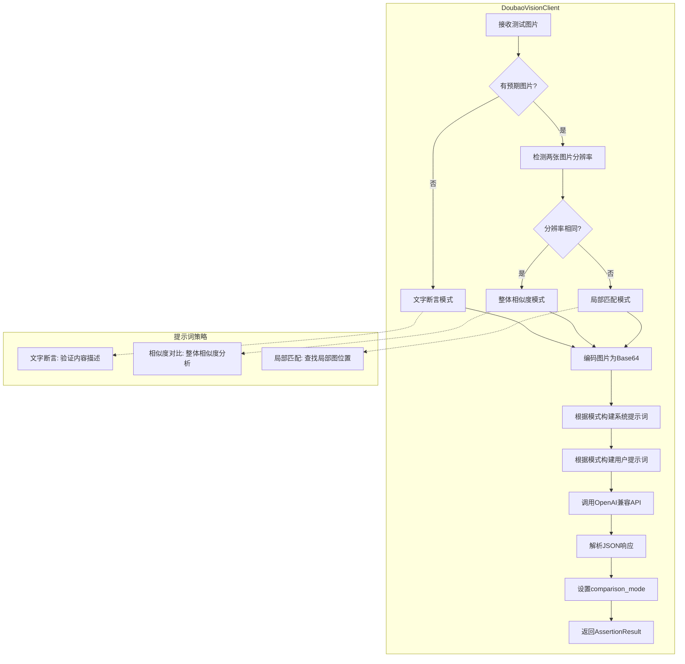
```mermaid
flowchart TB
    subgraph DoubaoVisionClient
        A[接收测试图片] --> A1{有预期图片?}
        A1 -->|是| B[检测两张图片分辨率]
        A1 -->|否| C1[文字断言模式]
        B --> B1{分辨率相同?}
        B1 -->|是| C2[整体相似度模式]
        B1 -->|否| C3[局部匹配模式]

        C1 --> D[编码图片为Base64]
        C2 --> D
        C3 --> D

        D --> E[根据模式构建系统提示词]
        E --> F[根据模式构建用户提示词]
        F --> G[调用OpenAI兼容API]
        G --> H[解析JSON响应]
        H --> I[设置comparison_mode]
        I --> J[返回AssertionResult]
    end

    subgraph 提示词策略
        P1["文字断言: 验证内容描述"]
        P2["相似度对比: 整体相似度分析"]
        P3["局部匹配: 查找局部图位置"]
    end

    C1 -.-> P1
    C2 -.-> P2
    C3 -.-> P3
```

**分辨率检测**

使用PIL库检测图片分辨率：
```python
def _get_image_resolution(self, image_bytes: bytes) -> Tuple[int, int]:
    image = Image.open(io.BytesIO(image_bytes))
    return image.size  # (width, height)

def _check_same_resolution(self, image_bytes, expect_image_bytes) -> bool:
    size1 = self._get_image_resolution(image_bytes)
    size2 = self._get_image_resolution(expect_image_bytes)
    return size1 == size2 and size1 != (0, 0)
```

**提示词工程**

系统提示词设计要点：
1. 明确角色定义为"图像视觉分析助手"
2. 严格定义JSON输出格式
3. 处理数量词理解（如"一双"="2"）
4. 低温度(0.1)确保输出稳定性
5. 根据对比模式选择不同的分析策略：
   - **整体相似度模式**: 强调对比两张图的整体相似程度
   - **局部匹配模式**: 强调在大图中查找小图内容及位置

### 6.2 任务管理器模块

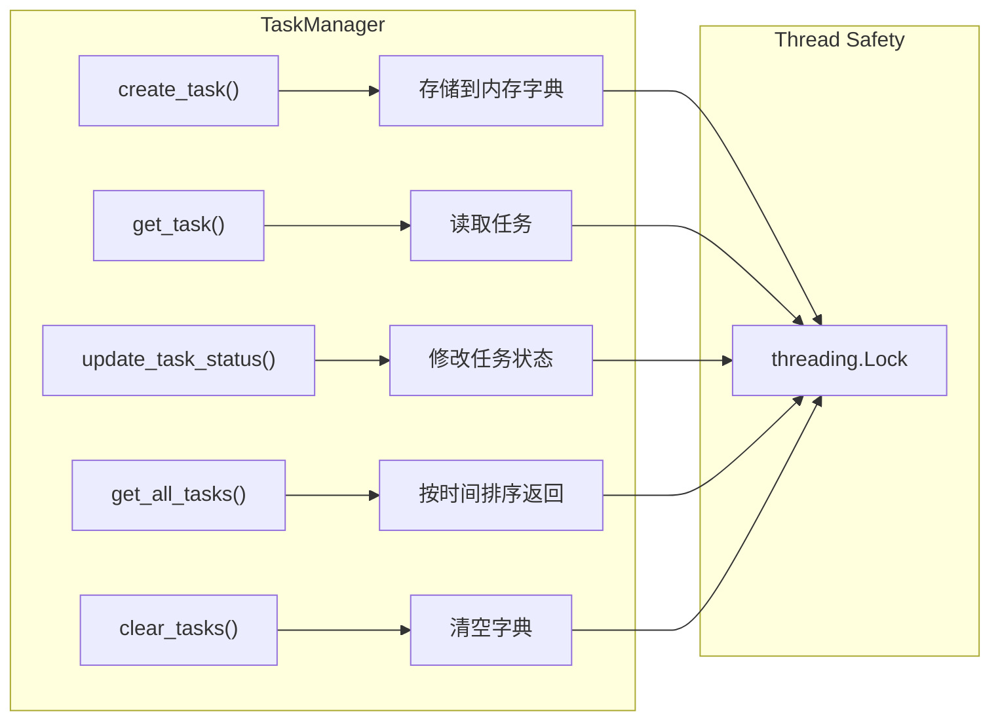
```mermaid
flowchart LR
    subgraph TaskManager
        direction TB
        Create["create_task()"] --> Store["存储到内存字典"]
        Get["get_task()"] --> Read["读取任务"]
        Update["update_task_status()"] --> Modify["修改任务状态"]
        List["get_all_tasks()"] --> Sort["按时间排序返回"]
        Clear["clear_tasks()"] --> Delete["清空字典"]
    end

    subgraph Thread Safety
        Lock["threading.Lock"]
    end

    Store --> Lock
    Read --> Lock
    Modify --> Lock
    Sort --> Lock
    Delete --> Lock
```

### 6.3 前端模块

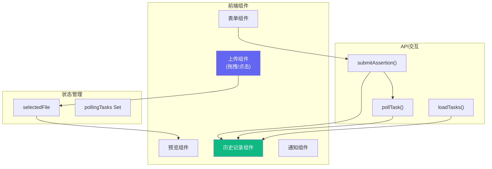
```mermaid
flowchart TB
    subgraph 前端组件
        Upload["上传组件<br/>(拖拽/点击)"]
        Preview["预览组件"]
        Form["表单组件"]
        History["历史记录组件"]
        Toast["通知组件"]
    end

    subgraph 状态管理
        selectedFile["selectedFile"]
        pollingTasks["pollingTasks Set"]
    end

    subgraph API交互
        Submit["submitAssertion()"]
        Poll["pollTask()"]
        Load["loadTasks()"]
    end

    Upload --> selectedFile
    selectedFile --> Preview
    Form --> Submit
    Submit --> History
    Submit --> Poll
    Poll --> History
    Load --> History

    style Upload fill:#6366f1,color:#fff
    style History fill:#10b981,color:#fff
```

---

## 7. 部署指南

### 7.1 环境要求

- Python 3.10+
- pip 或 conda 包管理器

### 7.2 安装步骤

```bash
# 1. 克隆代码
git clone <repository-url>
cd image_assertion_agent

# 2. 创建虚拟环境
python -m venv venv
source venv/bin/activate  # Linux/Mac
# 或 venv\Scripts\activate  # Windows

# 3. 安装依赖
pip install -r requirements.txt

# 4. 配置环境变量
cp .env.example .env
# 编辑 .env 文件，填入实际配置
```

### 7.3 环境变量配置

**基础配置**

| 变量名 | 必填 | 说明 | 默认值 |
|--------|------|------|--------|
| `DOUBAO_API_KEY` | 是 | 豆包API密钥 | - |
| `DOUBAO_MODEL_ENDPOINT` | 是 | 模型端点ID | - |
| `DOUBAO_API_BASE` | 否 | API基础URL | `https://ark.cn-beijing.volces.com/api/v3` |
| `HOST` | 否 | 服务监听地址 | `0.0.0.0` |
| `PORT` | 否 | 服务端口 | `8000` |
| `DEBUG` | 否 | 调试模式 | `false` |

**API重试配置**

| 变量名 | 说明 | 默认值 |
|--------|------|--------|
| `API_MAX_RETRIES` | 最大重试次数 | `3` |
| `API_RETRY_BASE_DELAY` | 基础延迟时间（秒） | `2.0` |
| `API_RETRY_MAX_DELAY` | 最大延迟时间（秒） | `30.0` |
| `API_TIMEOUT` | API调用超时时间（秒） | `60.0` |

**置信度配置**

| 变量名 | 说明 | 默认值 |
|--------|------|--------|
| `CONFIDENCE_THRESHOLD` | 置信度阈值 (0.0-1.0) | `0.7` |
| `LOW_CONFIDENCE_RETRY` | 低置信度时是否重试 | `true` |

**日志配置**

| 变量名 | 说明 | 默认值 |
|--------|------|--------|
| `LOG_LEVEL` | 日志级别 (DEBUG/INFO/WARNING/ERROR) | `INFO` |
| `LOG_DIR` | 日志目录路径 | `./logs` |

**存储配置**

| 变量名 | 说明 | 默认值 |
|--------|------|--------|
| `DATA_DIR` | 数据存储目录 | `./data` |

### 7.4 启动服务

```bash
# 开发环境
python run.py

# 生产环境
uvicorn image_assertion_agent.api.main:app --host 0.0.0.0 --port 8000 --workers 4
```

### 7.5 部署架构

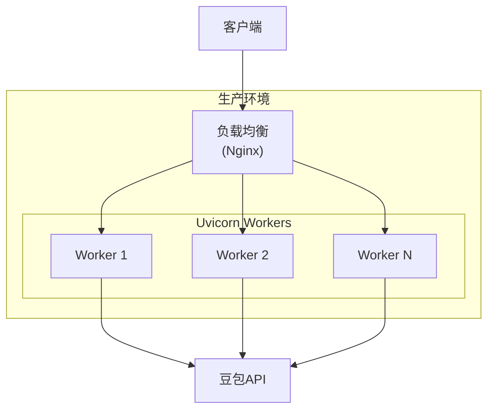
```mermaid
graph TB
    subgraph Production["生产环境"]
        LB["负载均衡<br/>(Nginx)"]

        subgraph Workers["Uvicorn Workers"]
            W1["Worker 1"]
            W2["Worker 2"]
            W3["Worker N"]
        end

        LB --> W1
        LB --> W2
        LB --> W3
    end

    Client["客户端"] --> LB
    W1 --> DoubaoAPI["豆包API"]
    W2 --> DoubaoAPI
    W3 --> DoubaoAPI
```

---

## 8. 使用示例

### 8.1 Python客户端调用

```python
from image_assertion_agent.client_example import ImageAssertionClient

# 创建客户端
client = ImageAssertionClient("http://localhost:8000")

# 方式1: 文件上传
result = client.assert_image_file(
    "shoes.jpg",
    "这张图里面有一双运动鞋"
)

# 方式2: URL断言
result = client.assert_image_url(
    "https://example.com/image.jpg",
    "图片中有3个红色苹果"
)

# 检查结果
if result["assertion_passed"]:
    print("✅ 断言通过!")
    print(f"置信度: {result['confidence']:.1%}")
else:
    print("❌ 断言失败")
    print(f"原因: {result['reason']}")
```

### 8.2 cURL调用

```bash
# 同步断言（仅文字预期）
curl -X POST "http://localhost:8000/assert/upload" \
  -F "image=@shoes.jpg" \
  -F "expectation=这张图里面有一双运动鞋"

# 异步断言（仅文字预期）
curl -X POST "http://localhost:8000/assert/async/upload" \
  -F "image=@shoes.jpg" \
  -F "expectation=这张图里面有一双运动鞋"

# 双图对比（测试图 + 预期图）
curl -X POST "http://localhost:8000/assert/async/upload" \
  -F "image=@test_image.jpg" \
  -F "expect_image=@expected_partial.jpg"

# 双图对比 + 文字预期
curl -X POST "http://localhost:8000/assert/async/upload" \
  -F "image=@test_image.jpg" \
  -F "expect_image=@expected_partial.jpg" \
  -F "expectation=预期图中的鞋子应该出现在左侧"

# 查询任务
curl "http://localhost:8000/task/{task_id}"
```

### 8.3 JavaScript调用

```javascript
// 异步上传
async function assertImage(file, expectation) {
    const formData = new FormData();
    formData.append('image', file);
    formData.append('expectation', expectation);

    // 提交任务
    const response = await fetch('/assert/async/upload', {
        method: 'POST',
        body: formData
    });
    const task = await response.json();

    // 轮询结果
    return await pollResult(task.task_id);
}

async function pollResult(taskId) {
    while (true) {
        const response = await fetch(`/task/${taskId}`);
        const task = await response.json();

        if (task.status === 'completed') {
            return task.result;
        } else if (task.status === 'failed') {
            throw new Error(task.error);
        }

        await new Promise(r => setTimeout(r, 2000));
    }
}
```

---

## 附录

### A. 错误码

| HTTP状态码 | 错误描述 |
|------------|----------|
| 400 | 请求参数错误（无效图片、Base64解码失败等） |
| 404 | 任务不存在 |
| 500 | 服务器内部错误（AI调用失败等） |
| 500 | 图像分析失败（重试已用尽）- RetryableError |
| 503 | 服务未配置（缺少API密钥） |

### A.1 内部错误类型

| 错误类型 | 说明 | 处理方式 |
|----------|------|----------|
| `RetryableError` | API调用失败且重试次数已用尽 | 记录日志，返回500错误 |
| `LowConfidenceWarning` | 置信度低于阈值 | 自动重试（如启用）或记录警告 |

### B. 性能指标

| 指标 | 参考值 |
|------|--------|
| 单次断言响应时间 | 3-10秒（取决于图片大小和网络） |
| 并发支持 | 取决于部署Worker数量 |
| 图片大小限制 | 10MB |

### C. 参考链接

- [火山引擎控制台](https://console.volcengine.com/ark)
- [豆包API文档](https://www.volcengine.com/docs/82379)
- [FastAPI官方文档](https://fastapi.tiangolo.com/)
- [Pydantic官方文档](https://docs.pydantic.dev/)

---

*文档版本: v1.2.0 | 最后更新: 2024年*

**更新日志**

- v1.2.0: 新增可靠性增强功能
  - API调用指数退避重试机制（3次重试，延迟2s/4s/8s）
  - SQLite持久化存储（任务、结果、API调用日志）
  - 完整日志记录系统（JSON文件日志 + 彩色控制台输出）
  - 请求追踪ID (trace_id) 贯穿整个请求生命周期
  - 可配置置信度阈值，支持低置信度自动重试
  - 新增 `database.py` 和 `logger.py` 核心模块
- v1.1.0: 新增双图对比功能，支持预期图片上传和智能对比模式选择
- v1.0.0: 初始版本，支持文字预期断言
